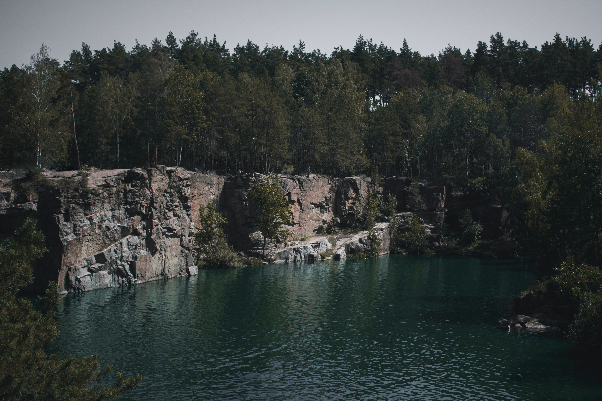
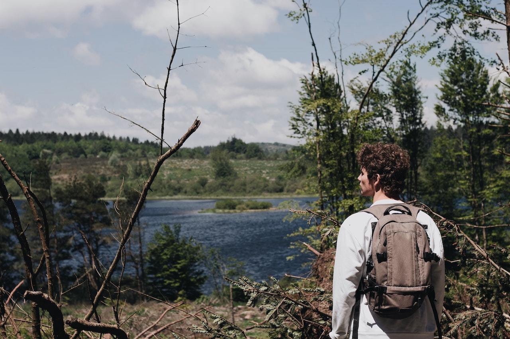

# 🏔️ ADVENTURE - Outdoor Exploration Website

A premium, fully responsive landing page for an outdoor adventure and travel agency. Designed with modern aesthetics, smooth animations, and a user-centric layout.

---

## 🚀 Live Preview
*(Add your hosted link here if applicable)*

## 📸 Project Showcases

|  |  |
|:---:|:---:|
| *Hero Section* | *Explore Section* |

> [!TIP]
> **Pro-Tip:** Replace the images above with your own screenshots in the `image/ss/` folder for a personalized touch!

---

## ✨ Key Features

- **💎 Premium Design**: Clean typography, vibrant colors, and professional layout.
- **📱 Fully Responsive**: Optimized for desktops, tablets, and mobile devices.
- **⚡ Interactive UI**: Smooth hover effects and dynamic menu for mobile users.
- **🎨 Glassmorphism & Gradients**: Modern styling techniques for a high-end feel.
- **📂 Image Gallery**: Elegant display of upcoming tours and destinations.

---

## 🛠️ Tech Stack

This project is built using pure web technologies to ensure maximum performance and compatibility:

- **HTML5**: Semantic structure for better SEO and accessibility.
- **CSS3**: Custom styles, Flexbox, and CSS Transitions for fluid animations.
- **JavaScript (ES6+)**: Vanilla JS for mobile menu interactivity.
- **Google Fonts**: "Poppins" for a modern, clean look.

---

## ⚙️ How to Run Locally

1. **Clone the Project:**
   ```bash
   git clone <your-repo-link>
   ```
2. **Navigate to the Directory:**
   ```bash
   cd Responsive_web
   ```
3. **Open `index.html`:**
   Simply double-click the `index.html` file in your browser, or use the **VS Code Live Server** extension for real-time updates.

---

## 📬 Get in Touch

Feel free to reach out for collaborations or just a friendly hello!

- **Email**: [zobhicode786@gmail.com](mailto:muhammadzohaib1090@gmail.com)
- **LinkedIn**: [Muhamad Zohaib](https://www.linkedin.com/in/muhamadzohaib/)
- **GitHub**: [github.com/muhamadzohaib](https://github.com/muhamadzohaib)

---

Developed with ❤️ by Muhamad Zohaib
